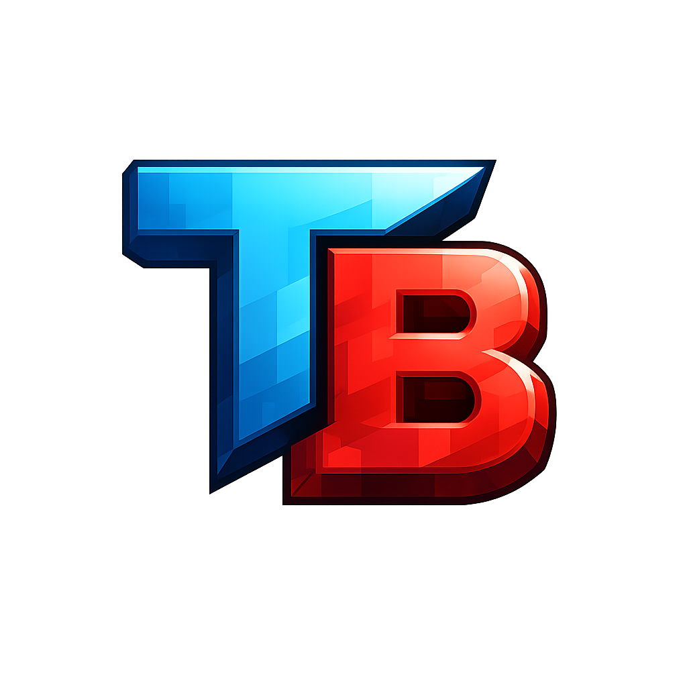

  
  &nbsp;&nbsp;&nbsp;&nbsp;
  

    

  
  
  
  

  <h1>TerraBlock</h1>
  
<b>A lightweight, high-performance, cross-platform voxel engine written in C++.</b>

---

## 📖 About The Project

**TerraBlock** is a custom-built voxel game engine heavily inspired by the early prototypes of Minecraft. 

The goal of this project is to build a hyper-optimized, standalone engine from scratch without relying on massive frameworks like Unity or Unreal. By writing memory-efficient C++ and leveraging multithreading, TerraBlock is designed to run incredibly fast on modern machines while maintaining strict compatibility with retro hardware.

### 🚀 Current State of the Game (v0.0.0.1 - Prototype)

Currently, the game is in its foundational prototype phase. The core engine architecture is complete:
*   **Infinite-Style Generation:** Asynchronous, multithreaded chunk generation that doesn't freeze the main thread.
*   **Classic Terrain:** A 256x64x256 world featuring 7 layers of varied dirt, deep stone, and caves.
*   **Voxel Physics:** Custom AABB grid collision allowing for smooth wall-sliding and snappy, frictionless movement.
*   **Pure Retro Graphics:** Powered by legacy OpenGL 1.1 with Flat-Shaded lighting and dynamic texture atlases.

---

## 🛠️ Built With

This engine was built from the ground up utilizing the following technologies:
*   **[C++11/17]** - Core engine logic, memory management, and multithreading.
*   **[CMake]** - Cross-platform build system for Linux and Windows.
*   **[Raylib]** - Window management, inputs, and hardware abstraction.
*   **[FastNoiseLite]** - Lightweight 2D/3D fractal noise generation.

---

## 🎮 How to Play

Head over to the [Releases](../../releases) tab and download the version for your operating system:
1.  **Extract the ZIP/TAR file** to a folder on your computer. *(Do not run the game directly from inside the archive!)*
2.  Ensure the `assets/` folder is located right next to the executable.
3.  Run `TerraBlock` (Linux) or `TerraBlock.exe` (Windows). 

**Controls:**
*   `W A S D` or `Left Stick` - Move
*   `Mouse` or `Right Stick` - Look
*   `Spacebar` or `A Button` - Jump (Hold to bunny-hop)
*   `R` - Hold to respawn dynamically
*   `ESC` - Quit Game

---

## 🗺️ Roadmap

- [x] TerraBlock Prototype v0.0.0.1 (Cave game tech test)
- [ ] **Next Up:** TerraBlock Prototype v0.0.0.2 (rd-132211)
- [ ] TerraBlock Prototype v0.0.0.3 (rd-132328)
- [ ] TerraBlock Prototype v0.0.0.4 (rd-20090515)
- [ ] TerraBlock Prototype v0.0.0.5 (rd-160052)
- [ ] TerraBlock Prototype v0.0.0.6 (rd-161348)
- [ ] TerraBlock v0.0.1 (Minecraft Classic [mc-161607])

---

## 🙏 Special Thanks

A massive thank you to **[Ray](https://github.com/raysan5)** and all the contributors behind **[Raylib](https://github.com/raysan5/raylib)**. 

Raylib's philosophy of providing a clean, C-based hardware abstraction layer without forcing a bloated IDE on the developer is what made this project possible. It is truly the ultimate library for learning how game engines actually work under the hood. 

*Also thanks to the `rres` packing system for keeping the assets clean and secure!*
